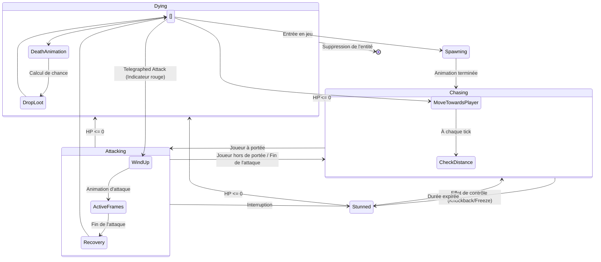

```mermaid
stateDiagram-v2
    [] --> Spawning : Entrée en jeu

    Spawning --> Chasing : Animation terminée

    state Chasing {
        [] --> MoveTowardsPlayer
        MoveTowardsPlayer --> CheckDistance : À chaque tick
    }

    Chasing --> Attacking : Joueur à portée

    state Attacking {
        [] --> WindUp : Telegraphed Attack (Indicateur rouge)
        WindUp --> ActiveFrames : Animation d'attaque
        ActiveFrames --> Recovery : Fin de l'attaque
        Recovery --> []
    }

    Attacking --> Chasing : Joueur hors de portée / Fin de l'attaque

    Chasing --> Stunned : Effet de contrôle (Knockback/Freeze)
    Attacking --> Stunned : Interruption

    Stunned --> Chasing : Durée expirée

    Chasing --> Dying : HP <= 0
    Attacking --> Dying : HP <= 0
    Stunned --> Dying : HP <= 0

    state Dying {
        [] --> DeathAnimation
        DeathAnimation --> DropLoot : Calcul de chance
        DropLoot --> []
    }

    Dying --> [*] : Suppression de l'entité
```
