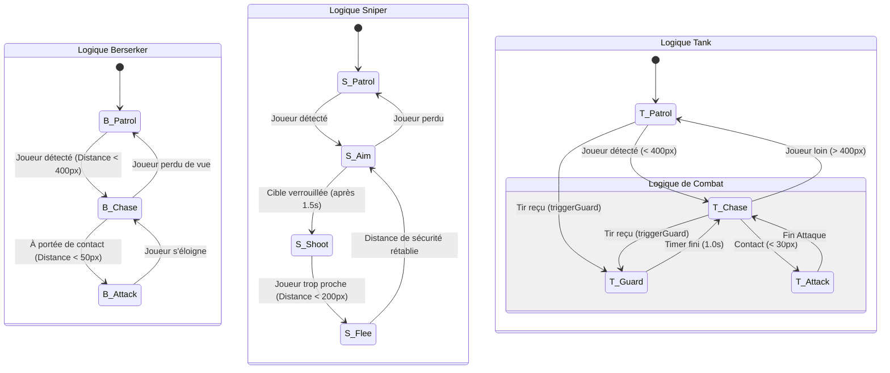

# Arene Survivor

Ce projet est un jeu de tir en vue de dessus réalisé avec C++ et SFML 3.0.2.

## Compilation et Exécution

1. **Exporter le projet:**
   * `git clone https://github.com/Alice2406/Arene-2D.git`
    
2.  **Ouvrir le projet :**
    * Lancez la solution `.sln` avec Visual Studio (17+).

3.  **Configuration :**
    * Sélectionnez la configuration **Debug** ou **Release**.
    * Assurez-vous que la plateforme est réglée sur **x64**.

4.  **Compilation :**
    * Générez la solution (`Ctrl + Shift + B`).
  
5.  **Execution :**
    * Executez le programme (`Ctlr + F5`)
  
      
## Contrôles

* **Z / Q / S / D** : Déplacements
* **Espace** : Attaquer
* **Echap** : Retour Menu

## FSM (NPC)

